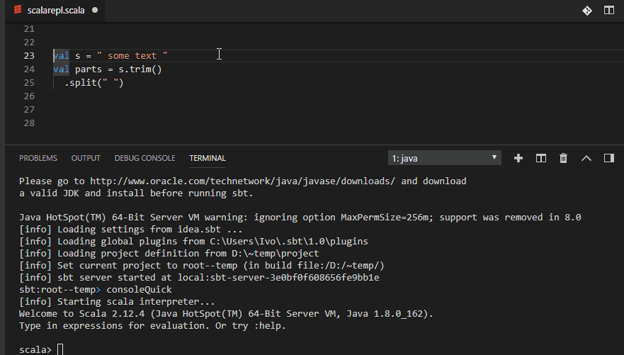

# SendToTerminal+, an extension for `vscode`

[VSCode extension](https://marketplace.visualstudio.com/items?itemName=ivoh.openfileatcursor) that enables sending text selection to the terminal. Can send multiline statements with defined prefix and/or postfix for the selected text so that language REPL can determine that the content will be multiline.

## Features

Predefined to allow sending multiline statements with `:paste`/`Ctrl+D` to `Scala`'s `console` or `spark-shell`.

```
val s = " some text "
val parts = s.trim()
  .split(" ")
```
will be send in `Scala` file as:
* Prefix:
```
:paste
```
* Selection
```
val s = " some text "
val parts = s.trim()
  .split(" ")
```
* Suffix:
```
Ctrl+D
```





If no selection is made then it sends the current line.

## Shortcut
```
Send selection : Alt + Shift + Enter
```


## Extension Settings

Default setting:
```
    "sendtoterminalplus.languages": [
        {
            "langId": "default",
            "shouldSendSelectionPerLines": false,
            "oneLineSelectionPayload": [
                "{selection}"
            ],
            "multiLineSelectionPayload": [
                "{selection}"
            ]
        },
        {
            "langId": "scala",
            "shouldSendSelectionPerLines": true,
            "oneLineSelectionPayload": [
                "{selection}"
            ],
            "multiLineSelectionPayload": [
                ":paste",
                "{selection}",
                "\u0004"
            ]
        }
    ]
```

This can be customized per language basis. The language id `default` is used for all undefined languages. `{selection}` is a marker replaced with selected text.

* `oneLineSelectionPayload`: defines text sent to the terminal when selected text is only one single line. E.g. ["{selection}"] would send one line with the selected text. ["a", "b", "c"] would send three lines with one character per line and not including the selected text at all.
* `multiLineSelectionPayload`: defines text sent to the terminal when selected text is more than one line. E.g. [":paste", "{selection}", "\u0004"] would send `:paste` then selected text (as single line or per lines based on `shouldSendSelectionPerLines` value) and then `Ctrl+D` key press. 
* `shouldSendSelectionPerLines`: will send the selected text (i.e. `{selection}`) line by line. This should circumvent limitation of selected text size sent to terminal on some the environments (e.g. Windows 7, etc...)


## Known Issues

There is no available vscode API for extensions to determine which terminal is active at this time. This extension therefore picks up the last opened terminal and remembers it so it sends each time the the payload to that terminal until the terminal is closed. In case there is no terminal opened it creates a new terminal which it uses for sending. 

There is `activeTerminal` API already implemented in the `--proposed-api` feature set. The current workaround will be replaced as soon as the API becomes stable and will be included in the RTM.

## Release Notes


### 0.1.0

Initial release.


-----------------------------------------------------------------------------------------------------------

